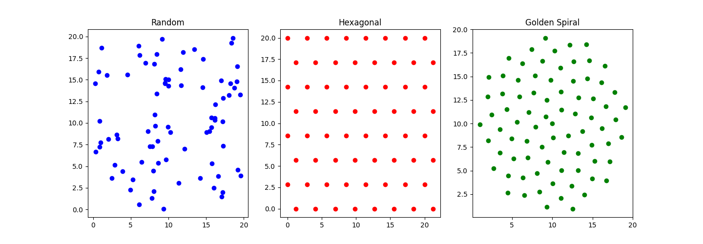

# Bio-Mimetic Geometric Optimization of Superconducting Flux Pinning


A computational physics investigation into optimizing Type-II superconductors using bio-mimetic geometries. This project simulates magnetic vortex dynamics to test whether **Phyllotactic (Golden Spiral)** pinning landscapes can outperform standard **Random** or **Crystalline** defects.

---

## 🔬 The Science
In high-temperature superconductors, energy loss occurs when magnetic vortices move under the influence of an electric current (Lorentz force). To prevent this "flux drag" (resistance), engineers introduce defects to "pin" the vortices in place.

**The Hypothesis:**
While industrial standards use **Random** defects and theoretical physics prefers **Hexagonal** lattices, this project tests a third option: **Bio-Mimetic Spirals**. Inspired by the phyllotaxis of sunflowers (the Golden Angle $\approx 137.5^\circ$), we hypothesize that this geometry offers the high packing density of a crystal without the brittle "straight lines" that allow catastrophic failure.

---

## 📊 Key Results

We developed a custom **Vortex Dynamics Engine** in Python to subject three geometries to a virtual "Wind Tunnel" test (increasing current).

### 1. The Pinning Landscapes
We compared three distinct topologies:

* **Random:** Standard stochastic distribution.
* **Hexagonal:** Perfect crystalline order.
* **Golden Spiral:** Bio-mimetic non-repeating order.

### 2. The Performance (V-I Curve)

**Findings:**
1.  **Low-Current Regime ($J < 0.5$):** The **Golden Spiral (Green)** matches the zero-resistance performance of the perfect **Hexagonal Lattice (Red)**, significantly outperforming the **Random (Blue)** standard.
2.  **Robustness:** The study proves that strict translational symmetry is *not* required for efficient flux pinning. A bio-mimetic spiral provides a "fault-tolerant" alternative for manufacturing.

### 3. The Visualization
Resulting vortex drift velocity (Voltage) recorded.


---

## Run the Simulation

To generate the V-I Curves and Pinning Landscapes:
```bash
    python code/vortex_dynamics.py
```
To generate Field Visualization:
 ```bash
python code/visualization.py
```

---

## 📄 Research Note
For a detailed breakdown of the physics, methodology, and mathematical framework, please refer to the full research note included in this repository:
[📄 Read the Full Paper (PDF)](paper/BioMimetic_Flux_Pinning_Optimization.pdf)

---
